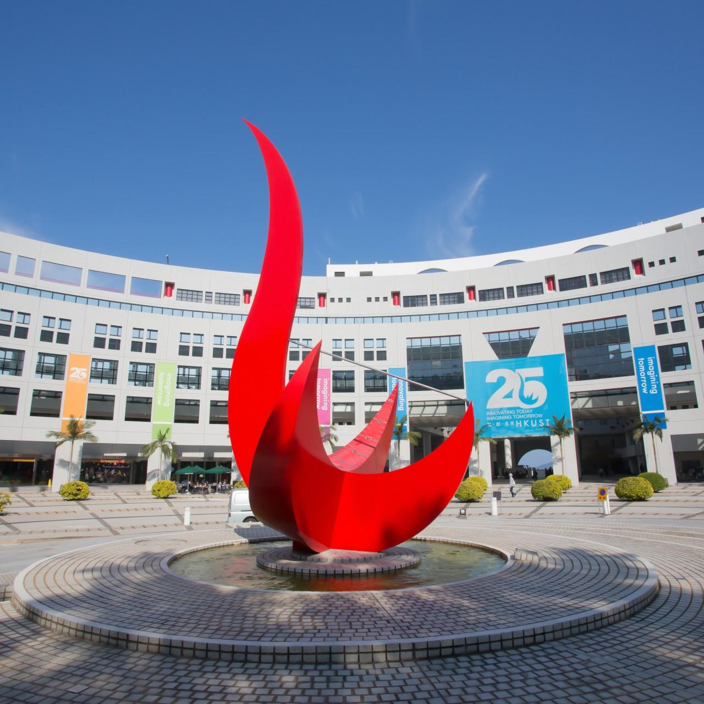
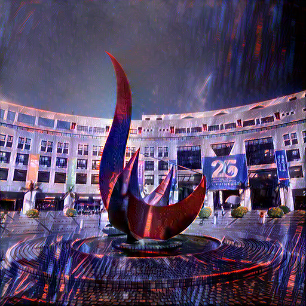

# Improvements towards Cyberpunk Style Transfer

teammates: Huang Junkai, Huang Yiming, Liu Pak Hin

We leveraged gradient loss and segmentation to improve neural style transfer pipeline.

    

HRNet.py is imported from another project.

style_transfer.py adds gredient loss.

style_transfer_HRNet.py adds HRNet in front.
